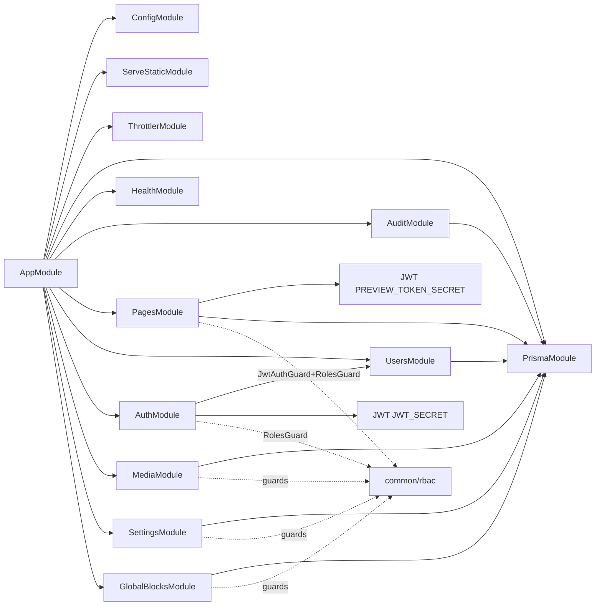
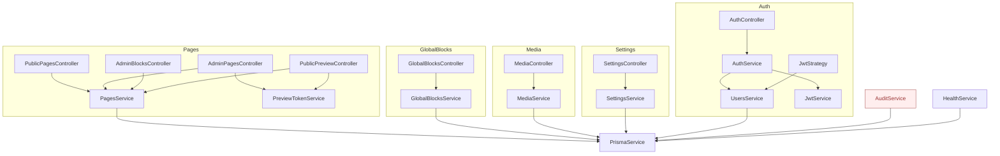
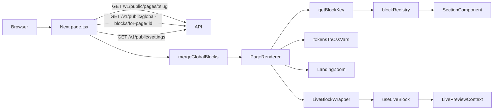
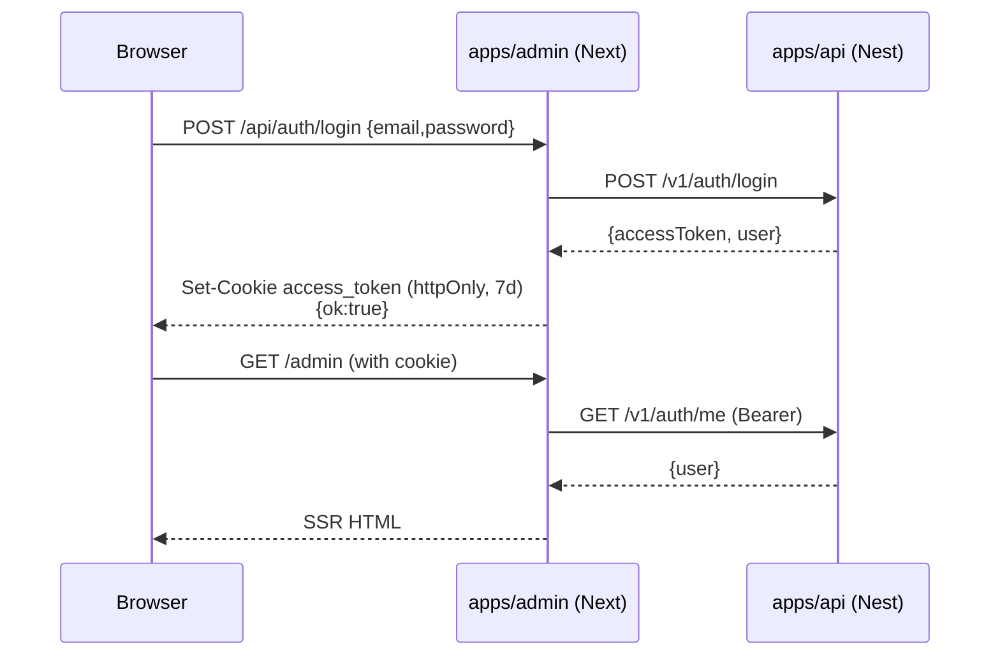
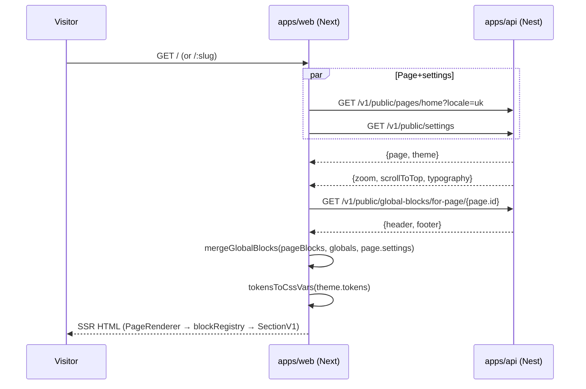
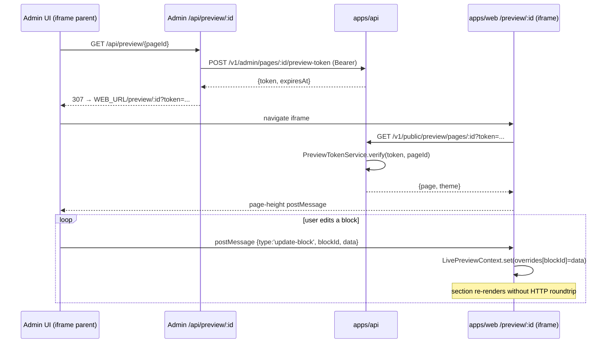
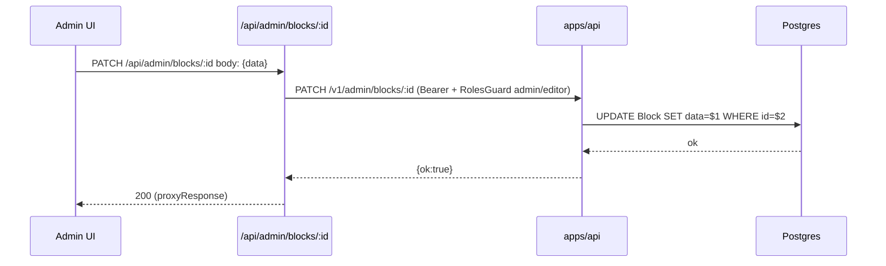

# `landing-admin-crm` — аналіз проєкту

> Репозиторій: [`ivarovskiy/landing-admin-crm`](https://github.com/ivarovskiy/landing-admin-crm)  
> Опис: «Dance Studio — Landing + Admin MVP» (back-end-driven landing з блоковою адмінкою).

Цей документ — **research-only**, без змін у коді. Структура:

1. Що ти писав «для Claude» — короткий зміст
2. Вертикальний аналіз (по шарах)
3. Горизонтальний аналіз (по доменах)
4. Граф проєкту і залежностей
5. Ключові місця бізнес-логіки і процесів
6. Критичні потоки end-to-end (з sequence-діаграмами)
7. Знайдені слабкі місця / технічний борг
8. Пропозиції наступних задач

---

## 1. Що ти писав «для Claude»

У репо я знайшов лише такі markdown / claude-related артефакти:

- `README.md` (root, 74 рядки) — головний MVP-довідник: стек, quickstart, admin-флоу, сидинг.
- `apps/api/README.md` — дефолтний шаблон NestJS, корисної інформації нема.
- `apps/admin/README.md`, `apps/web/README.md` — згенеровані `create-next-app`, теж шаблонні.
- `.claude/settings.json` — лише список дозволених bash-команд для Claude Code (`pnpm exec:*`, `git add/commit/push`, `tsc --noEmit` тощо) і `additionalDirectories` з memory-папкою на твоєму Windows-боксі (`c:\\Users\\ThinkPad\\.claude\\projects\\...\\memory`). Тобто реальні «робочі нотатки» для Claude лежать поза репо.
- `tec_task.txt` — порожній (0 байт). Очевидно мав бути технічний таск, але його забули додати.

**Висновок:** єдиний змістовний документ, написаний тобою — це root `README.md`. Все, що нижче — побудовано з аналізу коду, а не доків.

---

## 2. Вертикальний аналіз (по шарах)

```
┌──────────────────────────────────────────────────────────┐
│  Browser (public visitor)         Browser (admin user)   │
└────────────┬─────────────────────────────────┬───────────┘
             │ public HTML+CSS                 │ httpOnly cookie
             ▼                                 ▼
   ┌─────────────────────┐           ┌────────────────────────┐
   │ apps/web (Next 16)  │  iframe   │ apps/admin (Next 16)   │
   │  port 3002          │ ◄────────►│  port 3001             │
   │  - SSR landing       │ postMsg   │  - Admin SPA + BFF     │
   │  - /preview/:id      │           │  - /api/* proxy routes │
   │  - PageRenderer      │           │  - LiveBlockWrapper    │
   └──────┬──────────────┘           └──────────┬─────────────┘
          │ fetch (SSR)                         │ fetch (server)
          │ /v1/public/...                      │ /v1/admin/... + Bearer
          ▼                                     ▼
   ┌────────────────────────────────────────────────────────┐
   │ apps/api (NestJS 11) — port 3000  /v1/...              │
   │  modules: auth, users, pages, global-blocks, media,    │
   │           settings, audit, health                      │
   │  cross:   RBAC guard, JWT strategy, ThrottlerGuard,    │
   │           ValidationPipe, HttpExceptionFilter,         │
   │           requestId middleware, Swagger /docs          │
   └────────────────────────┬───────────────────────────────┘
                            │ Prisma 6
                            ▼
                ┌──────────────────────────┐
                │ Postgres 16 (docker)     │
                │  port 5433 → 5432        │
                │  vol: pgdata             │
                └──────────────────────────┘

                ┌──────────────────────────┐
                │ Local FS: <root>/uploads │
                │  served by ServeStatic   │
                └──────────────────────────┘
```

### 2.1 Інфраструктура / збірка

| Шар | Технологія | Деталі |
|---|---|---|
| Monorepo | pnpm workspaces 9.15.5 + Turborepo 2.8.11 | `pnpm-workspace.yaml`: `apps/*`, `packages/*`. `turbo.json` визначає `dev/build/lint/typecheck` |
| Контейнер | Docker | лише Postgres 16 у `docker-compose.yml` (хост-порт `5433`, юзер `app`/`app`) |
| Деплой бекенду | Railway (`apps/api/railway.toml` + `Dockerfile`) | окремий артефакт, фронти не сконфігуровані |
| Запуск dev | `pnpm dev` корінь → `concurrently` запускає api → admin (`wait-on tcp:3000`) → web (`wait-on tcp:3001`) |

### 2.2 База даних (Prisma `apps/api/prisma/schema.prisma`)

11 моделей, 7 міграцій (від `init` 2026-02-26 до `page_tree_and_scoped_globals` 2026-04-24).

| Модель | Призначення | Особливості |
|---|---|---|
| `User`, `Role`, `UserRole` | RBAC | `Role.key ∈ {admin, editor, viewer}`, M:N через `UserRole` |
| `Page` | Сторінка | `parentId` (self-relation `PageTree`), `@@unique([slug, locale])`, `seo` + `settings` як JSON |
| `Block` | Блок сторінки | `type`/`variant`/`order`/`data: Json`, `@@index([pageId, order])` |
| `Theme` | Дизайн-токени | `tokens: Json`, статус `draft|published`, активна = остання `published` |
| `GlobalBlock` | Глобальні блоки (header/footer) | `parentId` → null = site-wide; ≠ null → scoped до `Page.id` поддерева |
| `MediaAsset` | Файли | `url`, `providerKey` (поки лише `local`), розміри, теги |
| `SiteSettings` | Сінглтон (id `default`) | `zoom`, `scrollToTop`, `typography` як окремі JSON-стовпці |
| `AuditLog` | Журнал змін | `actor → User`, `entityType/entityId/action/diff`. **Не наповнюється** (див. розд. 7) |

Зверни увагу: схема тримає **всю варіативність блоків і налаштувань у JSON-полях**, а не в окремих таблицях. Це і є головне архітектурне рішення проєкту — «все є Block, і Block — це JSON».

### 2.3 Backend (`apps/api`)

NestJS 11, `versioning='1'` → префікс `/v1`. Bootstrap (`src/main.ts`) додає:
- `enableCors` (з `CORS_ORIGIN` ENV або `*` у dev),
- `requestIdMiddleware` (correlation id у логах),
- глобальний `ValidationPipe({ whitelist, forbidNonWhitelisted, transform })`,
- глобальний `HttpExceptionFilter` (уніфікований формат помилок),
- `SwaggerModule` за `/docs` + `/docs-json`,
- `ServeStaticModule` для `<monorepo>/uploads` → `/uploads/*`,
- `ThrottlerGuard` (default 100/хв, login `5/хв`).

Структура `src/`:

```
src/
├── main.ts
├── app.module.ts          ← реєструє всі модулі
├── common/
│   ├── filters/http-exception.filter.ts
│   ├── middleware/request-id.middleware.ts
│   ├── jwt-expires.ts
│   └── rbac/{role.ts, roles.decorator.ts, roles.guard.ts}
└── modules/
    ├── auth/      (Login, JWT, /auth/me)
    ├── users/     (UsersService — лише lookup)
    ├── pages/     (Pages + Blocks + Preview)
    ├── global-blocks/
    ├── media/     (Multer + локальний диск)
    ├── settings/  (SiteSettings singleton)
    ├── audit/     (Service зареєстрований, ніким не викликається)
    └── health/
```

Контракт відкривається OpenAPI’єм через `pnpm gen:openapi` → `packages/openapi-client/src/types.ts`.

### 2.4 Admin (`apps/admin`)

Next.js 16 (App Router), порт `3001`, React 19. Виконує дві ролі:

1. **BFF/проксі** — усі `app/api/admin/**/route.ts` читають `access_token` cookie, навішують `Authorization: Bearer <token>` і пробрасують у NestJS API (`getApiUrl()` з `lib/api-proxy.ts`).
2. **Адмін-UI** — серверні React-компоненти з `requireUser()` гардом (через `cookies()` + `/v1/auth/me`).

Ключові директорії:

```
src/
├── app/
│   ├── admin/(app)/              ← layout з gated-доступом, Pages list, /pages/:id, /globals, /settings
│   ├── admin/login/
│   └── api/                      ← BFF: auth/{login,logout}, admin/{pages,blocks,...}, preview/[id]
├── components/
│   ├── blocks-workspace.tsx      (1336 рядків — головний редактор)
│   ├── block-editor.tsx, block-edit-panel.tsx, block-json-panel.tsx
│   ├── add-block-form.tsx, delete-block-button.tsx, block-visibility-controls.tsx
│   ├── block-forms/              (по 1 формі на тип блоку: header/footer/hero/features/...)
│   ├── visual-editor/            ← новий «inspector»-режим
│   │    ├── adapters/{header-v1,hero-slider-v1,...}.ts + registry.ts
│   │    └── inspector-sections/{color,typography,layout,decoration,visibility,content}.tsx
│   ├── inspector/                (legacy-секції)
│   └── ...
├── lib/
│   ├── admin-api.ts              (тонкий typed-fetch до /v1 з OpenAPI types)
│   ├── api-proxy.ts              (BFF helpers)
│   ├── auth.ts                   (requireUser → /v1/auth/me або redirect)
│   ├── editor-schema.ts          (типи ElementNode/BlockNode для visual-editor)
│   ├── visibility.ts             (BlockHide → toggle/aggregate)
│   └── update-path.ts, array.ts
└── types/block.ts                (re-export з @acme/openapi-client)
```

### 2.5 Web (landing) (`apps/web`)

Next.js 16, порт `3002`. SSR-рендер блоків з API:

```
src/
├── app/
│   ├── page.tsx                ← homepage (slug='home')
│   ├── [slug]/page.tsx         ← решта сторінок
│   ├── preview/[id]/page.tsx   ← live-preview за токеном (без кешу)
│   ├── new-student-memo/page.tsx (статична сторінка)
│   ├── error.tsx, layout.tsx, fonts.ts
├── components/
│   ├── page-renderer.tsx       ← головна точка рендера
│   ├── blocks/
│   │    ├── registry.tsx       ← мапа `key → React component`
│   │    └── sections/{header-v1,hero-slider-v1,features-v1,studio-address-v1,
│   │                  content-page-v1,footer-v1,scrapbook-v1,text-block-v1,
│   │                  doc-header-v1,doc-body-v1,inline-icons}.tsx
│   ├── live-preview-provider.tsx, live-block-wrapper.tsx
│   ├── preview-scroll-listener.tsx, landing-zoom.tsx, media-image.tsx
│   └── landing/{ui,brand,icons}/...
├── lib/
│   ├── api-public.ts           ← public API client + mergeGlobalBlocks
│   ├── page-model.ts           ← `getHomePageModel` (НЕ використовується, dead-code)
│   ├── theme.ts                ← tokens → CSS vars
│   ├── safe-fetch.ts, section-utils.ts, use-reduced-motion.ts, cn.ts
└── middleware.ts               ← CORS лише для /preview/*
```

### 2.6 Спільні пакети (`packages/*`)

| Пакет | Роль |
|---|---|
| `@acme/openapi-client` | Згенеровані типи (`paths`, `components`, `operations`) + `openapi-fetch` клієнт. Регенерується через `pnpm -C packages/openapi-client gen` (тягне `/docs-json` живого API). |
| `@acme/block-library` | **Єдина точка істини про блоки**: `BLOCK_LIBRARY` (`BlockDefinition[]`), `BLOCK_PRESETS` (`BlockPreset[]`), `PAGE_TEMPLATES`, helper `getBlockKey(type, variant)`. Використовується і в admin, і в web. |
| `@acme/ui` | Дизайн-система: `Button`, `Input`, `Textarea`, `Card`, `Table`, `Badge`, `AlertDialog`, утиліта `cn`, `Slot`. CSS-токени в `packages/ui/styles/{tokens,base,animations,index}.css`. |

---

## 3. Горизонтальний аналіз (по доменах)

| Домен | Backend (NestJS) | Admin BFF/UI | Web | Storage |
|---|---|---|---|---|
| **Auth / RBAC** | `auth.module` (Login, JWT, /me, /logout), `JwtAuthGuard`, `RolesGuard` + `@Roles()` | `app/admin/login/page.tsx`, `app/api/auth/{login,logout}/route.ts`, `lib/auth.ts:requireUser` | — (публіка) | `User`, `Role`, `UserRole` + Argon2 хеш |
| **Pages CRUD** | `AdminPagesController` (GET/POST/PATCH/DELETE), `pages.service.{listAdmin,createPage,updatePage,deletePage,duplicatePage,publishPage,unpublishPage}` | `app/admin/(app)/pages/...`, `app/api/admin/pages/[id]/{publish,unpublish,duplicate}/route.ts` | `app/page.tsx`, `app/[slug]/page.tsx` (SSR) | `Page`, `Block` |
| **Blocks** | `AdminBlocksController` (PATCH data, POST `/move`, DELETE), `pages.service.{updateBlockData,createBlock,deleteBlock,moveBlock}` | `BlocksWorkspace`, `block-forms/*`, `visual-editor/*`, `app/api/admin/blocks/[id]/{,move}/route.ts` | `PageRenderer` + `blockRegistry` (через `getBlockKey`) | `Block.data` JSON |
| **Global blocks (header/footer)** | `GlobalBlocksController` + `GlobalBlocksService.{ensure,update,resolveForPage}` | `app/admin/(app)/globals/page.tsx`, `global-blocks-editor.tsx`, `app/api/admin/global-blocks/[key]/route.ts`, `lib/admin-api:fetchGlobalBlock` | `getGlobalBlocksForPage` + `mergeGlobalBlocks` у SSR-сторінках | `GlobalBlock(parentId, key)` |
| **Media** | `MediaController` (`/admin/media`, `/upload`), `MediaService` (Multer 10MB, allowlist MIME, мінімальний PNG/JPEG dim-parser) | `inspector/image-upload.tsx`, `app/api/admin/media/{,[id],upload}/route.ts` | `media-image.tsx` (рендер на /uploads/...) | `MediaAsset` + локальний диск `<root>/uploads/` |
| **Site Settings** | `SettingsController` (`/admin/settings` PATCH/GET, `/public/settings` GET), `SettingsService` (`upsert id='default'`) | `site-settings-form.tsx`, `lib/admin-api:fetchSiteSettings/updateSiteSettings` | `getSiteSettings` → `LandingZoom`, `scroll-to-top` | `SiteSettings` (singleton) |
| **Theme** | `pages.service.getActiveTheme` (latest published), `seed.ts` створює `key='default'` | (немає UI на theme; редагується вручну/seed) | `tokensToCssVars` → CSS-змінні на `<main>` | `Theme` |
| **Preview** | `AdminPagesController.createPreviewToken` + `PublicPreviewController` + `PreviewTokenService` (окремий JWT secret + TTL) | `app/api/preview/[id]/route.ts` (генерує токен → 307 на web) | `app/preview/[id]/page.tsx` + `LivePreviewProvider` (postMessage `update-block`/`page-height`) | — |
| **Audit** | `AuditModule` + `AuditService.log()` | — | — | `AuditLog` (таблиця є, але **не пишеться**) |
| **Health** | `HealthController` `/v1/health` | — | — | — |

Cross-cutting:
- **Версіонування URI** (`/v1/...`) — все API; admin- і web-клієнти жорстко закодовані на `/v1`.
- **httpOnly cookie `access_token`** — зберігається тільки в admin, ніколи не передається web’у.
- **Throttler**: глобально 100/хв, на `/auth/login` — 5/хв.
- **OpenAPI як контракт** — типи в admin/web імпортуються з `@acme/openapi-client`, тобто breaking-зміни в DTO ловляться TypeScript’ом.

---

## 4. Граф проєкту і залежностей

### 4.1 Workspace deps (workspace-only зв’язки)

```mermaid
flowchart LR
  subgraph apps
    web[apps/web<br/>Next 16, port 3002]
    admin[apps/admin<br/>Next 16, port 3001]
    api[apps/api<br/>NestJS 11, port 3000]
  end
  subgraph packages
    bl[@acme/block-library]
    oc[@acme/openapi-client]
    ui[@acme/ui]
  end

  admin -- workspace:^ --> bl
  admin -- workspace:^ --> oc
  admin -- workspace:^ --> ui
  web   -- workspace:^ --> bl
  web   -- workspace:^ --> oc

  oc  -. fetch /docs-json .-> api
  admin -. HTTP /v1/admin/* .-> api
  web   -. HTTP /v1/public/* .-> api
  admin -. iframe + postMessage .-> web
```

> Зверни увагу: **`web` НЕ залежить від `@acme/ui`** — лендинг тримає власні UI-атоми у `apps/web/src/components/landing/ui/*`. Це свідомий поділ (бренд-UI лендингу ≠ функційний UI адмінки).

### 4.2 Граф NestJS-модулів (api)



### 4.3 Граф контролерів і сервісів (хто-що викликає)



> `AuditService` (червоне) — **інжектний у модуль, але не використаний** жодним сервісом/контролером.

### 4.4 Граф рендера блоку (web)



---

## 5. Ключові місця бізнес-логіки

(посилання — `path:line`)

### 5.1 Доменні правила (apps/api)

| Що | Де | Чому це важливо |
|---|---|---|
| Активна тема = остання `published` | `apps/api/src/modules/pages/pages.service.ts:16-24` | Єдиний механізм перемикання теми; жодного UI |
| `Page.parentId` без циклів (DFS до 32 рівнів) | `pages.service.ts:242-258` | Захист від нескінченного дерева у `resolveForPage` |
| Авто-slug при `duplicatePage` | `pages.service.ts:185-196` | `${slug}-copy`, `-copy-2`, … (linear scan, не race-safe) |
| Перестановка блоків (swap, не shift) | `pages.service.ts:135-159` | Транзакційно міняє `order` між сусідами; масові реордери — O(1) на крок, але без gap-стратегії |
| `publishPage` / `unpublishPage` | `pages.service.ts:109-133` | Просто перемикає статус і `publishedAt`; жодного version-snapshot |
| Унікальність `slug+locale` (Prisma `@@unique`) | `schema.prisma:75` + ловиться в `handleUniqueViolation` | Гарантує адресну унікальність на рівні БД |
| Resolve global blocks по дереву → site fallback | `global-blocks.service.ts:105-144` | Найважливіша «магія» Globals: page → парент → … → null (site) |
| `mergeGlobalBlocks` (web) | `apps/web/src/lib/api-public.ts:68-100` | Синтетичні header/footer з `order=±1_000_000`, `id=global:<key>:<id>`; за `page.settings.disableGlobalHeader/Footer` можна вимкнути |
| Preview-токен (окремий JWT secret) | `pages/preview-token.service.ts` | `{sub: pageId, typ: "preview"}`, TTL з env, не приймає чужі типи токенів |
| Throttling логіну | `auth/auth.controller.ts:15` | `5/min` на `/auth/login` (через `@Throttle`) |
| Глобальний RBAC | `common/rbac/roles.guard.ts` | Метадан `@Roles(...)` → `RolesGuard` гарантує перетин з `req.user.roles` |

### 5.2 Доменні правила (admin)

| Що | Де |
|---|---|
| Гард SSR-сторінок адмінки | `apps/admin/src/lib/auth.ts:8-23` (`requireUser → /v1/auth/me`) |
| BFF-проксі з httpOnly cookie | `apps/admin/src/lib/api-proxy.ts` + всі `src/app/api/admin/**/route.ts` |
| Set httpOnly cookie при логіні | `apps/admin/src/app/api/auth/login/route.ts:36-43` (`sameSite=lax`, `secure` у prod, 7 днів) |
| Маршрут «Preview» | `apps/admin/src/app/api/preview/[id]/route.ts` — отримує токен у API і робить 307 на `WEB_URL/preview/:id?token=...` |
| BlockHide / responsive | `apps/admin/src/lib/visibility.ts` + `_layout.hide.{base,md,lg}` у `block.data` |
| Editor schema (visual editor) | `apps/admin/src/lib/editor-schema.ts` — типізує `ElementNode`/`BlockNode` для inspector’а |

### 5.3 Доменні правила (web)

| Що | Де |
|---|---|
| Розводка `home` vs `[slug]` | `apps/web/src/app/page.tsx` тягне `slug='home'`; `app/[slug]/page.tsx:9` робить `notFound()` для slug='home', щоб не плодити дублі |
| Live-preview через postMessage | `apps/web/src/components/live-preview-provider.tsx` — слухає `update-block` від батьківського iframe (admin), плюс репортить `page-height` назад |
| Тема → CSS vars | `apps/web/src/lib/theme.ts:tokensToCssVars` (хардкод-список вар) |
| Resolve `_layout` → CSS variables | `apps/web/src/components/page-renderer.tsx:24-45` (`--order-md`, `--display-md`, `--spacing-before/after`) |
| Block registry | `apps/web/src/components/blocks/registry.tsx` (10 секцій × `getBlockKey`) |

---

## 6. Критичні наскрізні потоки

### 6.1 Login → Admin SSR



### 6.2 Public landing render



### 6.3 Live preview (admin → iframe → web)



### 6.4 Block edit (persist)



---

## 7. Слабкі місця / технічний борг

> Перелік підкріплений посиланнями. Це не «фікси прямо зараз», а саме мапа місць, де тонко.

### 7.1 Безпека / контракти

1. **Audit ніким не пишеться.** `AuditService` зареєстрований у `AuditModule`, але немає жодного `audit.log(...)` виклику в усьому `apps/api/src`. Таблиця завжди порожня → CRUD-операції непомітні. *(`apps/api/src/modules/audit/audit.service.ts`, `audit.module.ts`)*
2. **Немає sanitizing для SVG-аплоадів.** `MediaController` дозволяє `image/svg+xml`; SVG зберігається як є → потенційний stored-XSS, якщо `` буде замінено на `<object>`/inline. *(`apps/api/src/modules/media/media.controller.ts:21-28`)*
3. **CORS у dev — wildcard.** `origin: true` (echo) при відсутньому `CORS_ORIGIN` + `credentials: true` — потенційно небезпечно якщо це попаде в prod. *(`apps/api/src/main.ts:16-21`)*
4. **`apps/web/src/middleware.ts`** виставляє `Access-Control-Allow-Origin: *` для `/preview/*`. Достатньо для public-iframe, але треба пам’ятати, що preview токен у URL.
5. **JWT для звичайного auth і preview мають окремі секрети** — це добре. Але `JwtModule.register` у `PagesModule` бере `secret: process.env.PREVIEW_TOKEN_SECRET` *синхронно при імпорті* (`pages.module.ts:13-15`) — якщо змінна не виставлена, `JwtModule` отримає `undefined` і впаде лише у момент `sign/verify`. Краще `forRootAsync` + явний `throw`.
6. **Race condition у duplicatePage.** Цикл `while findFirst → ${base}-${i}` не атомарний; під одночасним duplicate з’являться дублі або помилки `P2002`, які не обробляються (`pages.service.ts:185-196`).
7. **Немає rotation/revocation для preview-токенів.** `PREVIEW_TOKEN_TTL_SECONDS` у README = 7 днів, у `.env.example` = 1 година — невідповідність. Преглядачі з протіклими лінками лишаються «живими» весь TTL.

### 7.2 Інженерні

1. **Inconsistent env vars у web.** `lib/api-public.ts:3` читає `API_BASE_URL`, а `lib/page-model.ts:8` і `app/preview/[id]/page.tsx:24` — `API_URL`. Один деплой, два різні імена → один з них точно зафейлиться у проді.
2. **`getHomePageModel` мертвий код.** Експортується з `apps/web/src/lib/page-model.ts`, не використовується ніким (`grep` дав лише саме оголошення). Видалити або інтегрувати.
3. **MediaService — синхронні FS-виклики.** `fs.writeFileSync`, `fs.unlinkSync`, `fs.existsSync` блокують event loop під навантаженням (`apps/api/src/modules/media/media.service.ts:38,76-77`). Краще `fs.promises`.
4. **Немає `.env.example` для `apps/admin` і `apps/web`.** README говорить `cp .env.example .env.local`, але цих файлів немає в репо → новий розробник стикнеться з 500-кою на кроці 5.
5. **`tec_task.txt` — порожній.** Або видалити, або залити документ.
6. **Default Nest test-залишки.** `apps/api/src/app.controller.{ts,spec.ts}`, `app.service.ts` — не використовуються в `AppModule`, лежать як сирітки після `nest new`.
7. **Гігантські файли.** `BlocksWorkspace.tsx` — 1336 рядків, `header-v1.tsx` — 785, `block-library/src/index.ts` — 762. Це робить будь-яку зміну ризикованою.
8. **JSON-only варіанти блоків.** Усе в `Block.data`, тому Prisma не може дати тобі ні валідацію, ні індекси на структуру. Перехід до Zod-валідації на бекенді (DTO `data: any` зараз) — найперший корисний крок до надійності.
9. **`@acme/ui` майже не використовується у admin.** В `BlocksWorkspace` імпортуються `Button`, `Badge`, але більшість стилей живе через Tailwind+oklch інлайн → дизайн-система не розкручена.
10. **Немає тестів.** Лише `app.controller.spec.ts` (стандартний шаблон) і e2e-stub. Бізнес-логіка `pages.service` (cycle-detection, duplicate, move) — без покриття.
11. **Throttler на login** — добре, але глобальний `100/хв` може бути замало для admin із SSR-навантаженням (admin BFF робить 1-2 виклики на сторінку).

---

## 8. Перелік задач, які варто розглянути далі

Ось список, з якого можна по одній брати в роботу. Я спеціально розклав від «5 хвилин» до «пів дня».

### Дрібні (≤ 30 хв)

- [ ] Видалити мертвий код: `getHomePageModel`, `apps/api/src/app.controller.{ts,spec.ts}`, `app.service.ts`, порожній `tec_task.txt`.
- [ ] Уніфікувати env: усюди `API_URL` (або всюди `API_BASE_URL`).
- [ ] Додати `apps/admin/.env.example` і `apps/web/.env.example` (`API_URL`, `WEB_URL`, `NEXT_PUBLIC_API_URL`).
- [ ] Виставити коректний дефолт `PREVIEW_TOKEN_TTL_SECONDS` у `.env.example` (зараз 3600 vs README згадує 7 днів).
- [ ] У `pages.module.ts` замінити `JwtModule.register({secret: env...})` на `JwtModule.registerAsync` з явним throw, якщо `PREVIEW_TOKEN_SECRET` пустий.

### Середні (1–3 год)

- [ ] **Аудит-логування**: підв’язати `AuditService.log` у `pages.service` (publish/unpublish/duplicate/delete page, create/delete/move block) — entityType/entityId/action/diff. Це закриває розрив між схемою БД і кодом.
- [ ] **Zod-валідатори для `Block.data`**: schema-per-`type:variant` з `block-library`, валідується у `AdminBlocksController.PATCH` і `AdminPagesController.POST blocks`.
- [ ] **MediaService → async FS** + перевірка SVG (відсіювати `<script>`/`on*=` атрибути).
- [ ] **CI**: GitHub Actions workflow `pnpm install → turbo lint typecheck build` (хоча б на одному PR).
- [ ] **Тести `pages.service`** (cycle-detection, duplicatePage гонка, moveBlock на крайніх позиціях) — Jest у `apps/api`.

### Більші (½ дня+)

- [ ] **Розбити `BlocksWorkspace.tsx`** (1336 рядків) на: `Toolbar`, `LayersPanel`, `Inspector`, `Canvas` — кожне у власному файлі. Можна без зміни поведінки, лише структура.
- [ ] **Версіонування публікацій**: при `publishPage` робити snapshot `Block[]` у нову таблицю (`PageRevision`), щоб мати rollback / preview історичних версій. Зараз `publish` — це лише прапорець.
- [ ] **Media: pluggable provider** (`providerKey` уже зарезервовано в схемі) — додати S3-driver поряд з `local`. Готує проєкт до horizontal-deploy.
- [ ] **Admin Users CRUD** + редагування ролей (зараз ролі тільки через seed).
- [ ] **Інтеграційні тести**: один happy-path e2e (login → create page → add block → publish → public GET).

---

## 9. TL;DR для орієнтації

- **Архітектурне ядро**: «сторінка = `Page` + `Block[]`, де `Block.data` — JSON; рендер через `key=type:variant` + registry; глобальні header/footer окремою сутністю з resolve по дереву; тема — окремий published-snapshot токенів».
- **Найважливіші 5 файлів, які треба знати напам’ять**:
  1. `apps/api/prisma/schema.prisma` — модель даних.
  2. `apps/api/src/modules/pages/pages.service.ts` — майже вся бізнес-логіка.
  3. `apps/api/src/modules/global-blocks/global-blocks.service.ts` — `resolveForPage`.
  4. `apps/web/src/components/page-renderer.tsx` + `apps/web/src/lib/api-public.ts:mergeGlobalBlocks` — як це збирається у HTML.
  5. `apps/admin/src/components/blocks-workspace.tsx` — UX-серце адмінки.
- **Найбільш ризиковані для рефакторингу**: великі React-моноліти (`blocks-workspace.tsx`, `header-v1.tsx`) і JSON-без-схеми у `Block.data`.
- **Найпростіша «швидка перемога»**: підв’язати `AuditService` у мутаційні шляхи + Zod-валідація DTO блоків.
